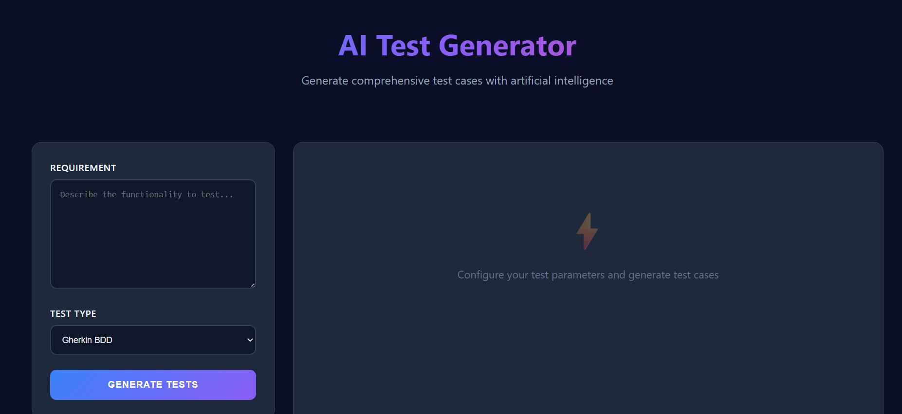
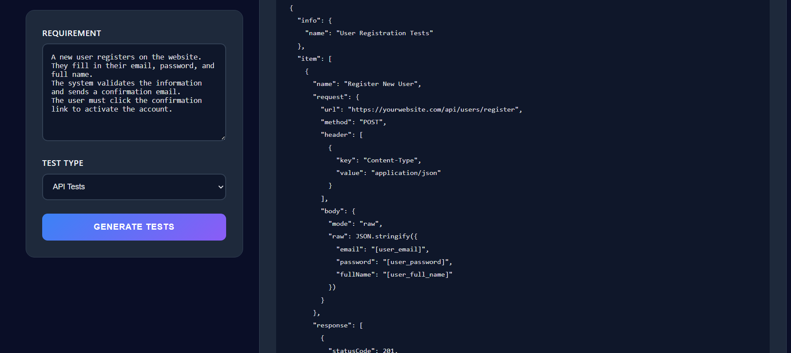
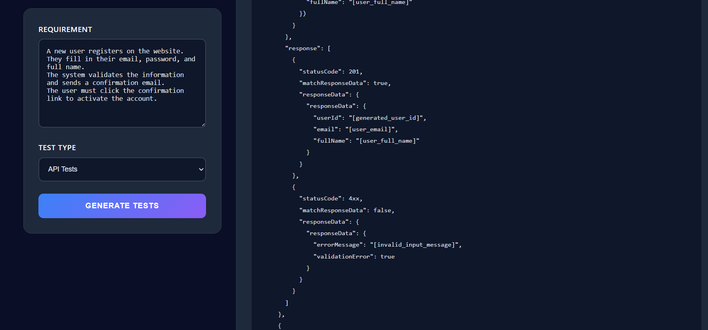
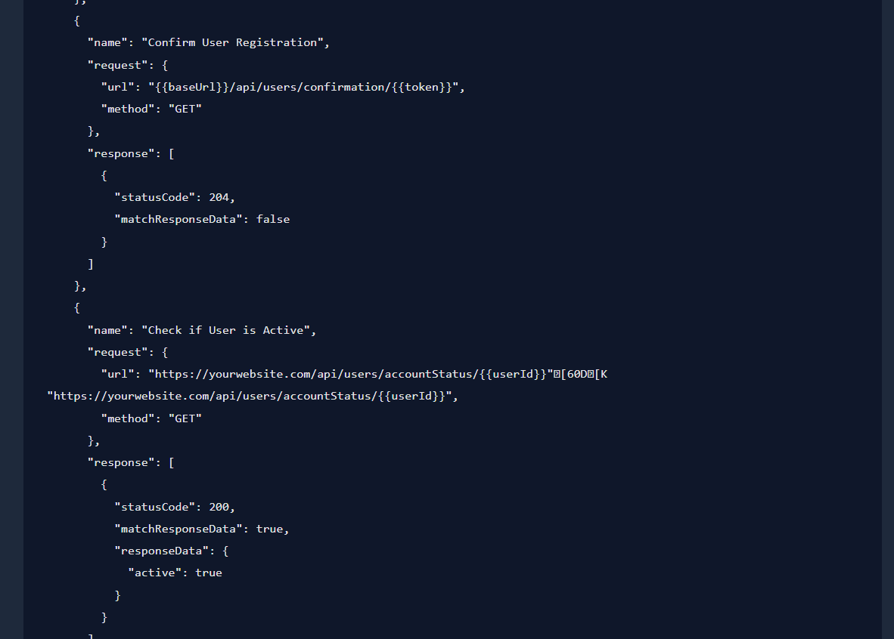

# ⚡ AI Test Generator

Une application web moderne et élégante qui utilise l'Intelligence Artificielle locale (**Ollama & Mistral**) pour générer instantanément des scénarios et scripts de test de haute qualité (Gherkin BDD, Pytest, E2E, API, Performance, OWASP).







## 📌 Présentation du Projet

**AI Test Generator** permet aux ingénieurs QA et développeurs de saisir des spécifications ou exigences fonctionnelles et d'obtenir immédiatement des cas de test prêts à l'emploi. Le système intègre un pipeline intelligent de nettoyage de texte et un mécanisme de résilience robuste (fallback) en cas d'indisponibilité du modèle LLM.

---

## 🏗️ Architecture du Système

Le projet repose sur une architecture simple et efficace composée d'un serveur Web léger, d'une couche d'orchestration IA locale et d'un processeur de texte.

```mermaid
flowchart TD
    subgraph Frontend [Interface Utilisateur]
        UI[Navigateur Web - HTML5/CSS3]
    end

    subgraph Backend [Serveur Flask]
        APP[app.py - Contrôleur Flask]
        CLEAN[Nettoyeur Regex - clean_ollama_output]
    end

    subgraph AI [Couche Génération IA]
        GEN[test_generator.py - TestGenerator]
        OLLAMA[CLI Ollama - Modèle Mistral]
        MOCK[Fallback - Générateur MOCK]
    end

    UI -->|1. Envoi exigences & type de test| APP
    APP -->|2. Demande de génération| GEN
    
    GEN -->|3a. Exécute prompt| OLLAMA
    OLLAMA -->|4a. Retourne réponse brute| GEN
    
    GEN -.->|3b. Si Ollama indisponible (erreur)| MOCK
    MOCK -.->|4b. Retourne tests mockés de secours| GEN

    GEN -->|5. Nettoyage de base| APP
    APP -->|6. Nettoyage des phrases conversationnelles| CLEAN
    CLEAN -->|7. Rendu HTML final avec statistiques| UI

    style UI fill:#1e293b,stroke:#3b82f6,stroke-width:2px,color:#fff
    style APP fill:#1e293b,stroke:#8b5cf6,stroke-width:2px,color:#fff
    style GEN fill:#1e293b,stroke:#ec4899,stroke-width:2px,color:#fff
    style OLLAMA fill:#0f172a,stroke:#10b981,stroke-width:2px,color:#fff
    style MOCK fill:#0f172a,stroke:#f59e0b,stroke-dasharray: 5 5,color:#fff
```

### 🔁 Flux de fonctionnement :
1. **Saisie utilisateur** : L'utilisateur entre les spécifications fonctionnelles et sélectionne le type de test (ex: pytest, playwirght, etc.).
2. **Orchestration** : `test_generator.py` prépare un prompt structuré et interroge **Ollama** via des appels système en tâche de fond.
3. **Robustesse (Fallback)** : Si le service Ollama n'est pas démarré ou si le modèle n'est pas présent, le système intercepte l'erreur et génère des cas de tests simulés ("Mock") pour garantir que l'application ne plante pas.
4. **Post-traitement & Nettoyage** : La réponse brute de l'IA est nettoyée grâce à des filtres Regex dans `app.py` pour éliminer les formules de politesse de l'IA ("Here is your test case", "Note:", etc.) et ne garder que le code ou le texte utile.
5. **Rendu Web** : L'interface affiche le code avec un compteur dynamique de caractères et de lignes et un bouton de copie rapide.

---

## 🛠️ Technologies Utilisées

- **Backend** : 
  -  3.x
  -  (Framework Web)
- **Intelligence Artificielle** :
  -  (Orchestrateur local)
  - **Modèle Mistral 7B** (Modèle LLM local rapide et performant)
- **Frontend** :
  - HTML5 & CSS3 (Design personnalisé sombre avec gradients vibrants, responsive design et composants interactifs)
  - Vanilla JS (Pour la copie rapide du code généré)

---

## 🚀 Fonctionnalités Clés

- **Gherkin BDD** : Génère des scénarios `Given/When/Then` structurés.
- **Pytest Unit** : Produit du code de test unitaire Python fonctionnel avec assertions.
- **API Tests** : Génère des requêtes de test au format JSON compatibles Postman.
- **Test Data** : Crée des jeux de données avec valeurs valides, invalides et limites.
- **OWASP Security** : Identifie les failles potentielles et génère des payloads de test (ex: injections SQL, XSS).
- **Performance** : Produit des scripts Locust de charge ou des snippets JMeter.
- **E2E Automation** : Fournit des scripts prêts à l'exécution en Playwright ou Selenium.
